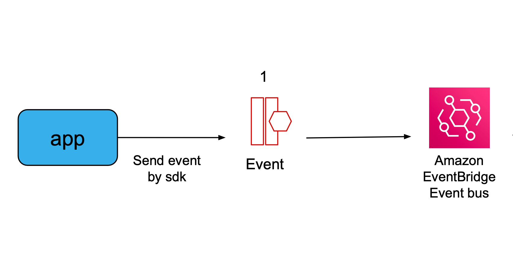
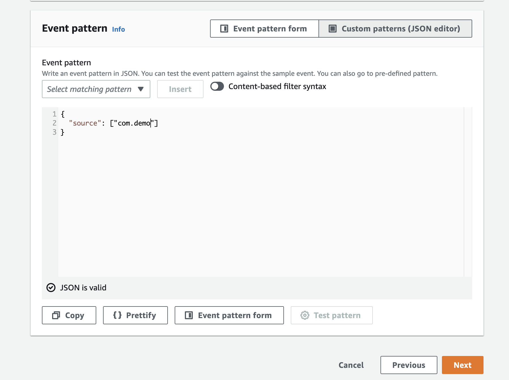
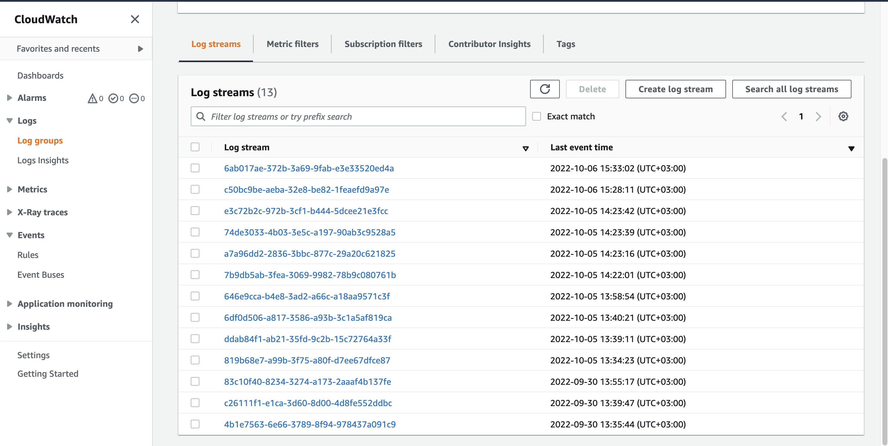

# Spring-boot EventBridge publisher

[EventBridge](https://aws.amazon.com/eventbridge/)



### Step 1: Implementation publisher event to EventBridge.

* Need to add sdk dependency:
```xml
<dependency>
   <groupId>com.amazonaws</groupId>
   <artifactId>aws-java-sdk-eventbridge</artifactId>
   <version>${eventbridge.version}</version>
</dependency>
```
* Then we need to implement this code snippet to send an event to the EventBridge's event bus:

```java
        try (EventBridgeClient eventBridgeClient = EventBridgeClient.builder()
                .build()) {

            PutEventsRequestEntry requestEntry = PutEventsRequestEntry.builder()
                    .source("com.demo") // match pattern for the the rule
                    .detail("Your object") // object that need convert to json string
                    .detailType("Just a simple detail type") // required field
                    .eventBusName("demo-event-bus") // your created custom event bus in EventBridge
                    .build();

            List<PutEventsRequestEntry> requestEntries = Collections.singletonList(requestEntry);

            PutEventsRequest eventsRequest = PutEventsRequest.builder()
                    .entries(requestEntries)
                    .build();

            putEventsResponse = eventBridgeClient.putEvents(eventsRequest);
        } catch (IOException e) {
            throw new RuntimeException(e);
        }
```

* [Configure your aws credentials](https://docs.aws.amazon.com/sdk-for-java/v1/developer-guide/setup-credentials.html)

### Step 2: Configure EventBridge

[Go to - EventBridge](https://us-east-1.console.aws.amazon.com/events/home?region=us-east-1#/)

#### Create custom event bus
* Click on navigation panel under **Events** -> Event buses.
* Click on button **Create event bus**
* Choose name of event bus
* Create

#### Create custom rule
* Click on navigation panel under **Events** -> Rules.
* Click on button **Create rule**
* Choose the event bus that you previously created
* Click Next
* Choose under Event source **Other**
* Add event pattern
  
* Click Next
* Tarrget 1 - select AWS Service
* Select target type **CloudWatch log group**
* Write a new group or choose existing group
* Create rule

### Step 3: Start spring application and send request/event

* Run application
* Send Post http request to http://localhost:8080/tn
with payload:
```json
{
  "source": "com.demo",
  "eventBus": "demo-event-bus",
  "detail": {
      "tn": "1234567890"
  }
}
```
* Go to **CloudWatch** service
* Click on navigation panel under **Logs** -> Log groups. 
* Find your log group and click on it.
* You should see the lists of eventIds, choose one to look into details.
  